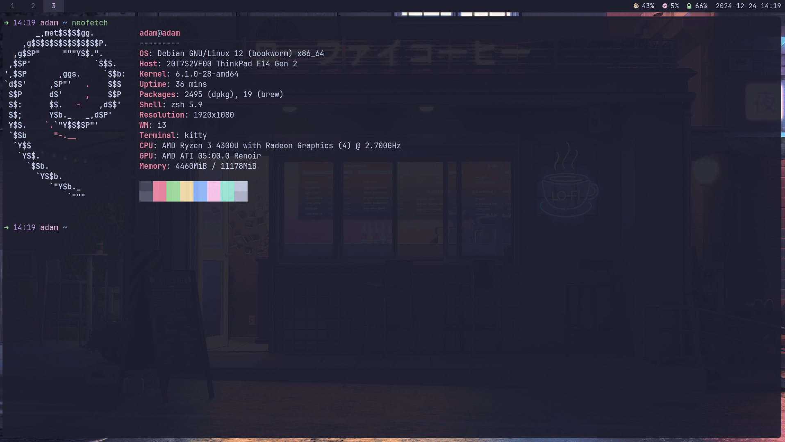

# 🛠️ My Dotfiles

Welcome to my dotfiles repo! This repo contains config files for my dev env. These files rn are manually managed, but I plan to integrate [GNU Stow](https://www.gnu.org/software/stow/) in the future for easier management.



---

## 📁 Dir Structure

Here’s an overview of the directories in this repository:

- **i3/**: Configuration files for my window manager ([i3](https://i3wm.org/)).
- **kitty/**: Configurations for my terminal emulator ([Kitty](https://sw.kovidgoyal.net/kitty/)).
- **nvim/**: My [Neovim](https://neovim.io/) setup, including custom plugins and settings.
- **polybar/**: Custom configurations for [Polybar](https://polybar.github.io/) 
- **tmux/**: Configurations for [Tmux](https://github.com/tmux/tmux), my terminal multiplexer.
- **zsh/**: [Zsh](https://www.zsh.org/) and [Oh My Zsh](https://ohmyz.sh/) customizations.

  I also plan to add my picom config and other things - stay tuned!
---

## 🚀 Installation

1. **Clone the repository**:
   ```bash
   git clone https://github.com/adamDucken/dotfiles.git ~/dotfiles
   ```

2. **Backup your current config files** (if needed):
   ```bash
   mkdir -p ~/dotfiles_backup
   cp -r ~/.config/i3 ~/.config/kitty ~/.config/nvim ~/.config/polybar ~/.config/tmux ~/.zshrc ~/dotfiles_backup
   ```

3. **Copy the configurations**:
   ```bash
   cp -r ~/dotfiles/* ~/.config/
   ```

4. **Restart your session** to apply the changes.

5. **It might not work** in that case you will have to debug. Good Luck :)

---

## 🛡️ Future Plans

- Integrate **GNU Stow** to simplify symlink management for the configuration files.
- Automate syncing between `~/.config` and this repository.
- Add other tools of choice that I use - stay tuned. 
---
